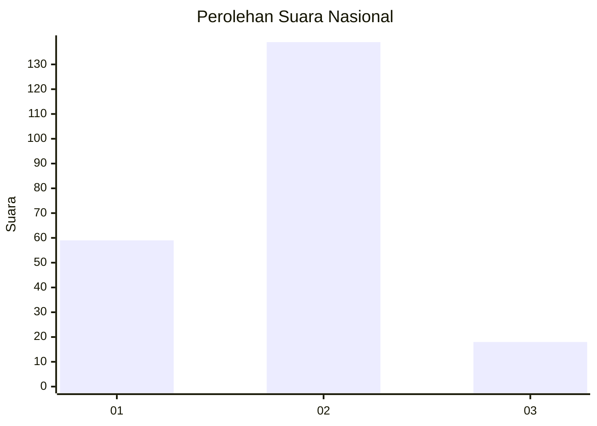
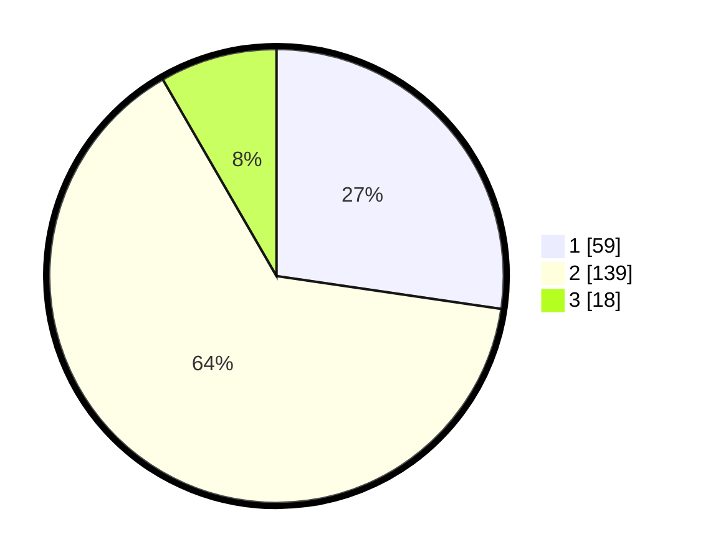

# Hasil

## Grafik

## Tabel

| No. | Nama Paslon    | Suara | Suara (raw) | Persentase |
|:--- |:-------------- | -----:| -----------:| ----------:|
| 1   | ANIES MUHAIMIN | 59    | [59][p-1]   | 27,31      |
| 2   | PRABOWO GIBRAN | 139   | [139][p-2]  | 64,35      |
| 3   | GANJAR MAHFUD  | 18    | [18][p-3]   | 8,33       |

[p-1]: https://github.com/gigit-pemilu/pemilu-2024/blob/main/pilpres/hitung-suara/sub/52-nusa-tenggara-barat/sub/71-kota-mataram/sub/06-sandubaya/sub/1001-dasan-cermen/sub/003-tps/sub/paslon-1.txt
[p-2]: https://github.com/gigit-pemilu/pemilu-2024/blob/main/pilpres/hitung-suara/sub/52-nusa-tenggara-barat/sub/71-kota-mataram/sub/06-sandubaya/sub/1001-dasan-cermen/sub/003-tps/sub/paslon-2.txt
[p-3]: https://github.com/gigit-pemilu/pemilu-2024/blob/main/pilpres/hitung-suara/sub/52-nusa-tenggara-barat/sub/71-kota-mataram/sub/06-sandubaya/sub/1001-dasan-cermen/sub/003-tps/sub/paslon-3.txt

## Foto C Plano

https://sirekap-obj-formc.kpu.go.id/4543/pemilu/ppwp/52/71/06/10/01/5271061001003-20240215-075457--80db61f5-60d6-4caf-8424-a20492cd9bfb.jpg

https://sirekap-obj-formc.kpu.go.id/4543/pemilu/ppwp/52/71/06/10/01/5271061001003-20240215-075728--cd24cd15-17db-4324-8324-7756e884658e.jpg

https://sirekap-obj-formc.kpu.go.id/4543/pemilu/ppwp/52/71/06/10/01/5271061001003-20240215-075916--8369628c-73ae-4d9b-b43b-fb316d76c49e.jpg

## Metadata

| Key        | Value               |
| ---------- | ------------------- |
| Time Stamp | 2024-02-19 06:16:00 |

