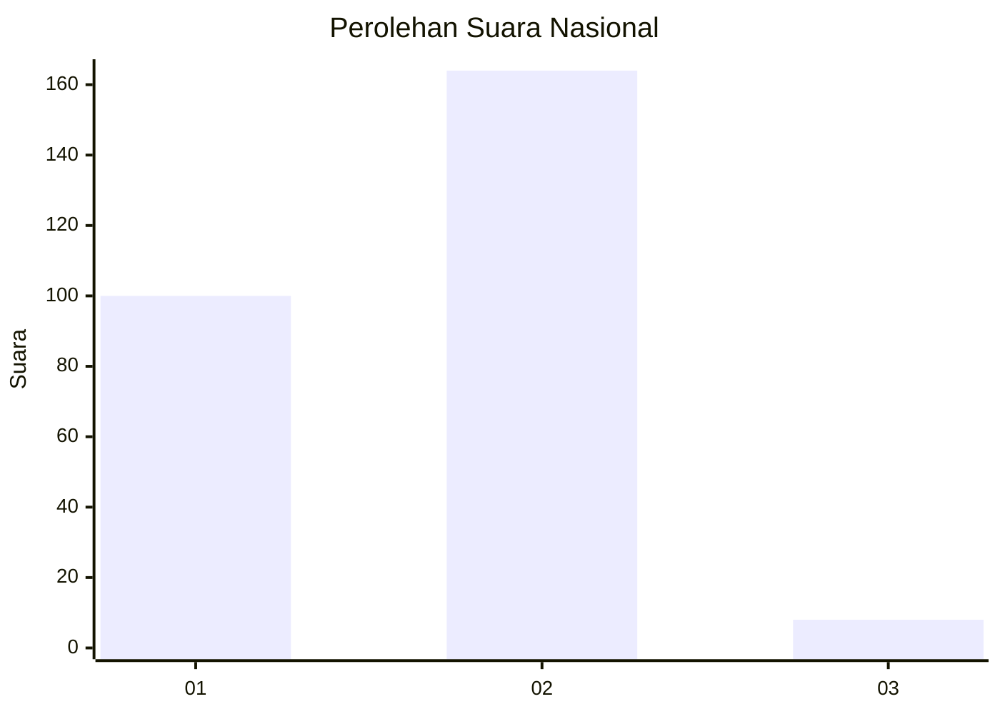
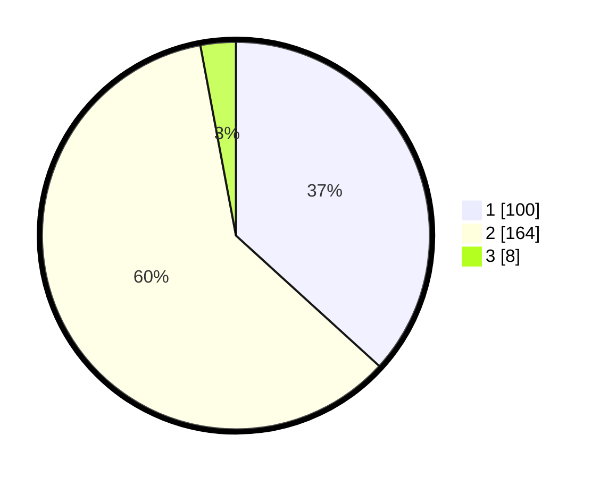

# Hasil

## Grafik

## Tabel

| No. | Nama Paslon    | Suara | Suara (raw) | Persentase |
|:--- |:-------------- | -----:| -----------:| ----------:|
| 1   | ANIES MUHAIMIN | 100   | [100][p-1]  | 36,76      |
| 2   | PRABOWO GIBRAN | 164   | [164][p-2]  | 60,29      |
| 3   | GANJAR MAHFUD  | 8     | [8][p-3]    | 2,94       |

[p-1]: https://github.com/gigit-pemilu/pemilu-2024/blob/main/pilpres/hitung-suara/sub/52-nusa-tenggara-barat/sub/72-kota-bima/sub/01-rasanae-barat/sub/1001-paruga/sub/003-tps/sub/paslon-1.txt
[p-2]: https://github.com/gigit-pemilu/pemilu-2024/blob/main/pilpres/hitung-suara/sub/52-nusa-tenggara-barat/sub/72-kota-bima/sub/01-rasanae-barat/sub/1001-paruga/sub/003-tps/sub/paslon-2.txt
[p-3]: https://github.com/gigit-pemilu/pemilu-2024/blob/main/pilpres/hitung-suara/sub/52-nusa-tenggara-barat/sub/72-kota-bima/sub/01-rasanae-barat/sub/1001-paruga/sub/003-tps/sub/paslon-3.txt

## Foto C Plano

https://sirekap-obj-formc.kpu.go.id/aa80/pemilu/ppwp/52/72/01/10/01/5272011001003-20240215-082438--9c6f0e31-99fa-4bb4-8522-cfdfb750508c.jpg

https://sirekap-obj-formc.kpu.go.id/aa80/pemilu/ppwp/52/72/01/10/01/5272011001003-20240215-083013--04b3c74c-81ca-43d0-b18f-9bcb667185b2.jpg

https://sirekap-obj-formc.kpu.go.id/aa80/pemilu/ppwp/52/72/01/10/01/5272011001003-20240215-082828--4adb8eac-3a24-4a29-bca7-ab7227f4cfa2.jpg

## Metadata

| Key        | Value               |
| ---------- | ------------------- |
| Time Stamp | 2024-02-15 21:01:18 |

