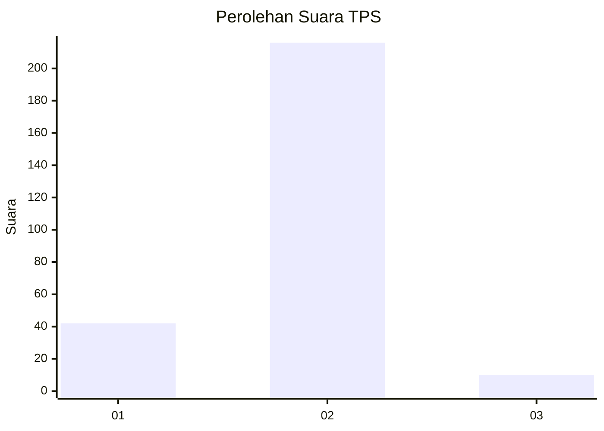
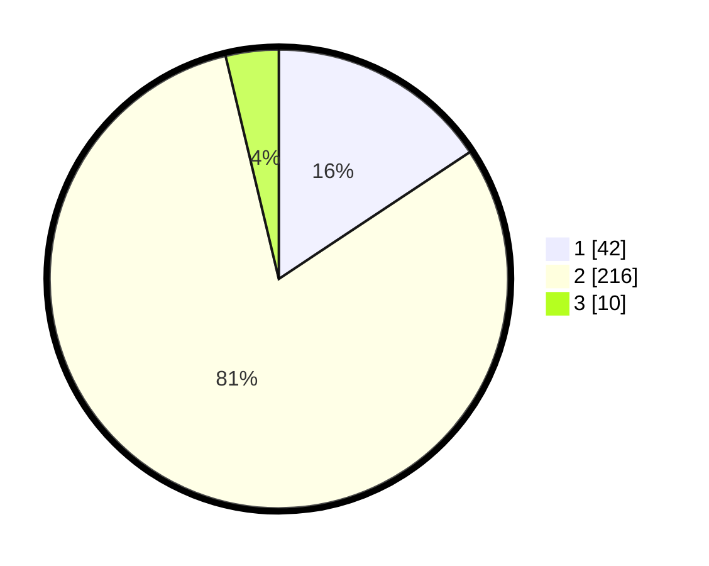

# Hasil

## Grafik

## Tabel

| No. | Nama Paslon    | Suara | Suara (raw) | Persentase |
|:--- |:-------------- | -----:| -----------:| ----------:|
| 1   | ANIES MUHAIMIN | 42    | [42][p-1]   | 15,67      |
| 2   | PRABOWO GIBRAN | 216   | [216][p-2]  | 80,60      |
| 3   | GANJAR MAHFUD  | 10    | [10][p-3]   | 3,73       |

[p-1]: https://github.com/gigit-pemilu/pemilu-2024-52-nusa-tenggara-barat/blob/main/pilpres/hitung-suara/sub/52-nusa-tenggara-barat/sub/72-kota-bima/sub/01-rasanae-barat/sub/1014-dara/sub/016-tps/sub/paslon-1.txt
[p-2]: https://github.com/gigit-pemilu/pemilu-2024-52-nusa-tenggara-barat/blob/main/pilpres/hitung-suara/sub/52-nusa-tenggara-barat/sub/72-kota-bima/sub/01-rasanae-barat/sub/1014-dara/sub/016-tps/sub/paslon-2.txt
[p-3]: https://github.com/gigit-pemilu/pemilu-2024-52-nusa-tenggara-barat/blob/main/pilpres/hitung-suara/sub/52-nusa-tenggara-barat/sub/72-kota-bima/sub/01-rasanae-barat/sub/1014-dara/sub/016-tps/sub/paslon-3.txt

## Foto C Plano

https://sirekap-obj-formc.kpu.go.id/3688/pemilu/ppwp/52/72/01/10/14/5272011014016-20240302-113555--f9eac762-dc75-4a02-afe1-c857f2e93e9a.jpg

https://sirekap-obj-formc.kpu.go.id/3688/pemilu/ppwp/52/72/01/10/14/5272011014016-20240302-113603--100fa39f-dcca-4cc6-8ee9-30d0402aeaba.jpg

https://sirekap-obj-formc.kpu.go.id/3688/pemilu/ppwp/52/72/01/10/14/5272011014016-20240302-113610--9540fae7-5d27-406d-83c0-5c0aaca2373c.jpg

## Metadata

| Key        | Value               |
| ---------- | ------------------- |
| Time Stamp | 2024-03-16 11:30:00 |

