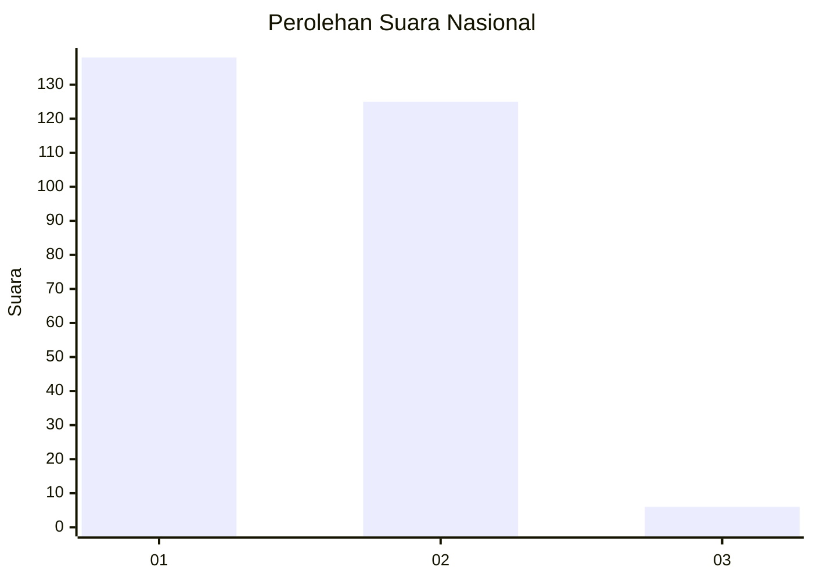
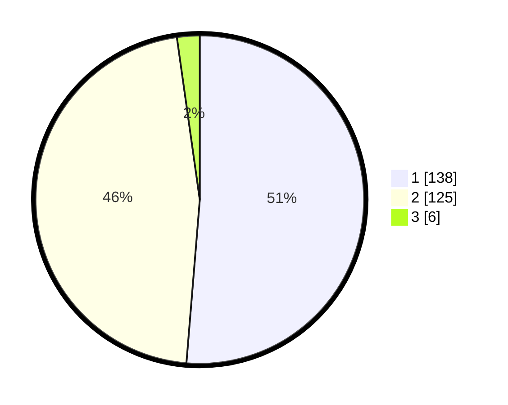

# Hasil

## Grafik

## Tabel

| No. | Nama Paslon    | Suara | Suara (raw) | Persentase |
|:--- |:-------------- | -----:| -----------:| ----------:|
| 1   | ANIES MUHAIMIN | 138   | [138][p-1]  | 51,30      |
| 2   | PRABOWO GIBRAN | 125   | [125][p-2]  | 46,47      |
| 3   | GANJAR MAHFUD  | 6     | [6][p-3]    | 2,23       |

[p-1]: https://github.com/gigit-pemilu/pemilu-2024/blob/main/pilpres/hitung-suara/sub/52-nusa-tenggara-barat/sub/72-kota-bima/sub/03-asakota/sub/1001-melayu/sub/010-tps/sub/paslon-1.txt
[p-2]: https://github.com/gigit-pemilu/pemilu-2024/blob/main/pilpres/hitung-suara/sub/52-nusa-tenggara-barat/sub/72-kota-bima/sub/03-asakota/sub/1001-melayu/sub/010-tps/sub/paslon-2.txt
[p-3]: https://github.com/gigit-pemilu/pemilu-2024/blob/main/pilpres/hitung-suara/sub/52-nusa-tenggara-barat/sub/72-kota-bima/sub/03-asakota/sub/1001-melayu/sub/010-tps/sub/paslon-3.txt

## Foto C Plano

https://sirekap-obj-formc.kpu.go.id/e742/pemilu/ppwp/52/72/03/10/01/5272031001010-20240226-213109--497ed9b2-1ac9-432c-bd63-c72f0a8ffafe.jpg

https://sirekap-obj-formc.kpu.go.id/e742/pemilu/ppwp/52/72/03/10/01/5272031001010-20240227-144044--38a467da-9d0e-4a38-8d39-1c150721fbd8.jpg

https://sirekap-obj-formc.kpu.go.id/e742/pemilu/ppwp/52/72/03/10/01/5272031001010-20240227-144051--cfe75b4f-fd3c-40fb-a7e7-53679128c48e.jpg

## Metadata

| Key        | Value               |
| ---------- | ------------------- |
| Time Stamp | 2024-02-28 11:00:00 |

