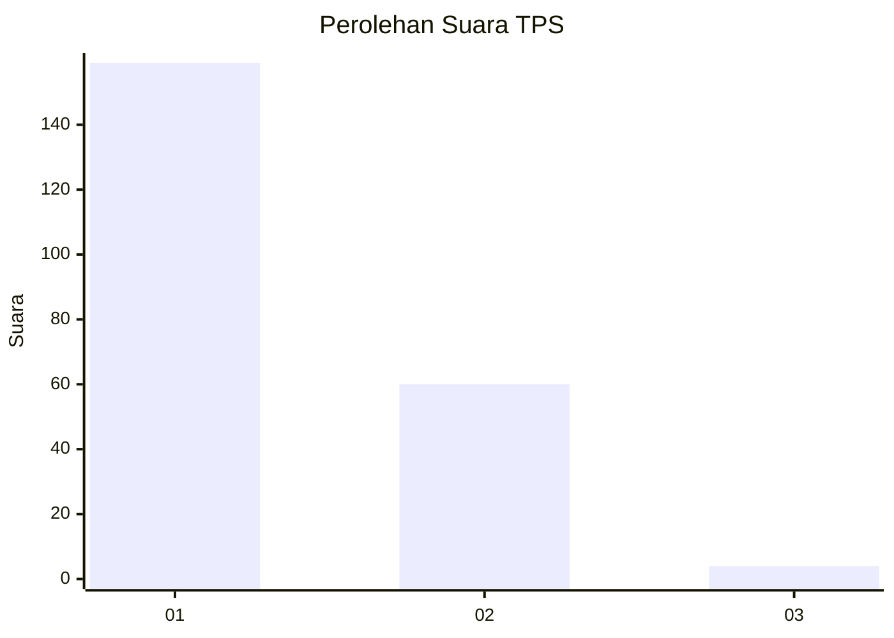
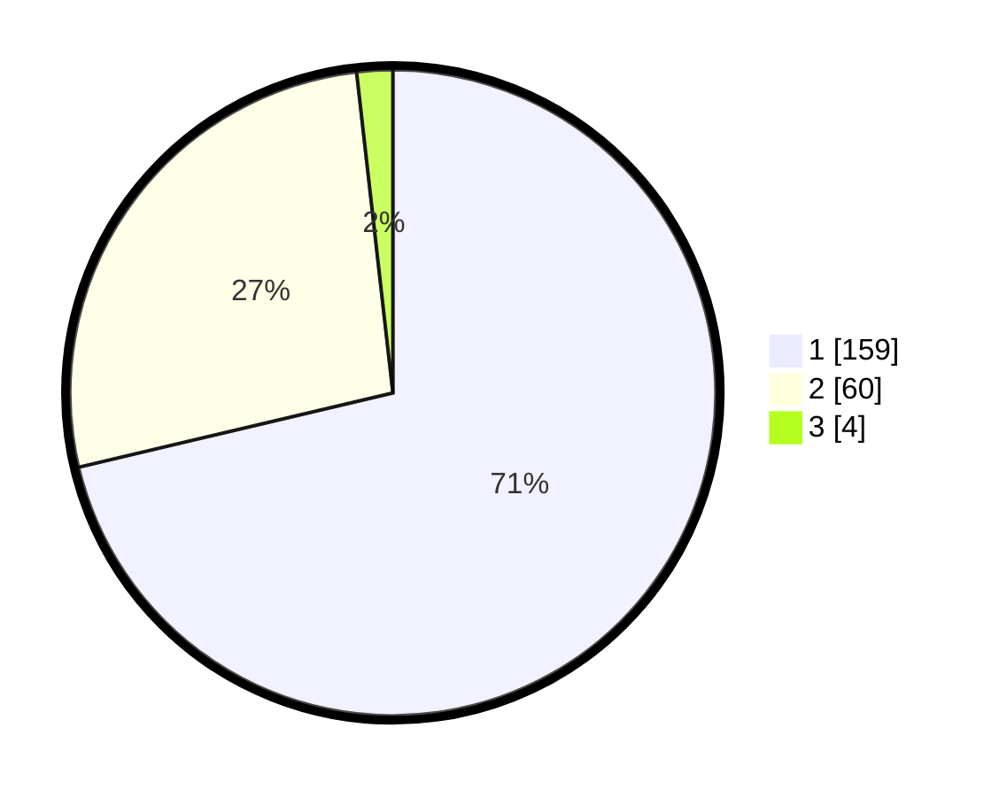

# Hasil

## Grafik

## Tabel

| No. | Nama Paslon    | Suara | Suara (raw) | Persentase |
|:--- |:-------------- | -----:| -----------:| ----------:|
| 1   | ANIES MUHAIMIN | 159   | [159][p-1]  | 71,30      |
| 2   | PRABOWO GIBRAN | 60    | [60][p-2]   | 26,91      |
| 3   | GANJAR MAHFUD  | 4     | [4][p-3]    | 1,79       |

[p-1]: https://github.com/gigit-pemilu/pemilu-2024-52-nusa-tenggara-barat/blob/main/pilpres/hitung-suara/sub/52-nusa-tenggara-barat/sub/72-kota-bima/sub/03-asakota/sub/1001-melayu/sub/012-tps/sub/paslon-1.txt
[p-2]: https://github.com/gigit-pemilu/pemilu-2024-52-nusa-tenggara-barat/blob/main/pilpres/hitung-suara/sub/52-nusa-tenggara-barat/sub/72-kota-bima/sub/03-asakota/sub/1001-melayu/sub/012-tps/sub/paslon-2.txt
[p-3]: https://github.com/gigit-pemilu/pemilu-2024-52-nusa-tenggara-barat/blob/main/pilpres/hitung-suara/sub/52-nusa-tenggara-barat/sub/72-kota-bima/sub/03-asakota/sub/1001-melayu/sub/012-tps/sub/paslon-3.txt

## Foto C Plano

https://sirekap-obj-formc.kpu.go.id/31bd/pemilu/ppwp/52/72/03/10/01/5272031001012-20240305-020910--2f6c1154-7a1f-4610-8e60-75c97252b422.jpg

https://sirekap-obj-formc.kpu.go.id/31bd/pemilu/ppwp/52/72/03/10/01/5272031001012-20240305-020921--1132464e-1326-4134-8542-3f7debf1d5e7.jpg

https://sirekap-obj-formc.kpu.go.id/31bd/pemilu/ppwp/52/72/03/10/01/5272031001012-20240305-020932--e5e36794-6dd7-4e70-b704-0a5fa2af60ff.jpg

## Metadata

| Key        | Value               |
| ---------- | ------------------- |
| Time Stamp | 2024-03-16 12:00:00 |

