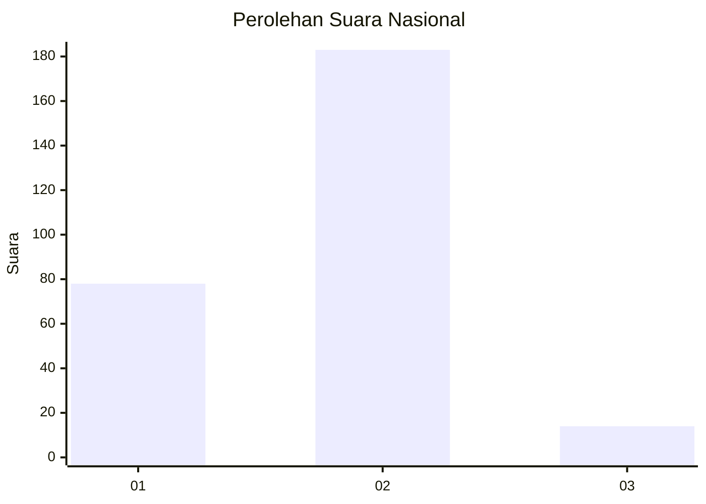
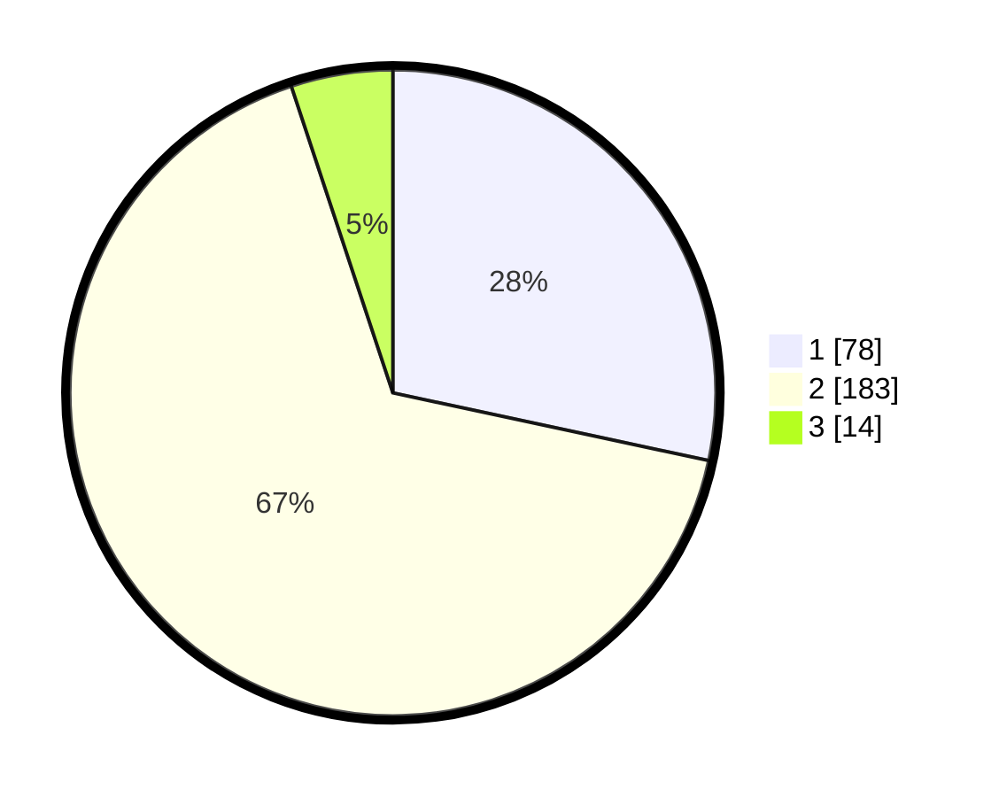

# Hasil

## Grafik

## Tabel

| No. | Nama Paslon    | Suara | Suara (raw) | Persentase |
|:--- |:-------------- | -----:| -----------:| ----------:|
| 1   | ANIES MUHAIMIN | 78    | [78][p-1]   | 28,36      |
| 2   | PRABOWO GIBRAN | 183   | [183][p-2]  | 66,55      |
| 3   | GANJAR MAHFUD  | 14    | [14][p-3]   | 5,09       |

[p-1]: https://github.com/gigit-pemilu/pemilu-2024/blob/main/pilpres/hitung-suara/sub/52-nusa-tenggara-barat/sub/72-kota-bima/sub/03-asakota/sub/1003-jatibaru/sub/005-tps/sub/paslon-1.txt
[p-2]: https://github.com/gigit-pemilu/pemilu-2024/blob/main/pilpres/hitung-suara/sub/52-nusa-tenggara-barat/sub/72-kota-bima/sub/03-asakota/sub/1003-jatibaru/sub/005-tps/sub/paslon-2.txt
[p-3]: https://github.com/gigit-pemilu/pemilu-2024/blob/main/pilpres/hitung-suara/sub/52-nusa-tenggara-barat/sub/72-kota-bima/sub/03-asakota/sub/1003-jatibaru/sub/005-tps/sub/paslon-3.txt

## Foto C Plano

https://sirekap-obj-formc.kpu.go.id/aa2d/pemilu/ppwp/52/72/03/10/03/5272031003005-20240215-171255--d2f9f790-9392-4c03-82de-38341354a591.jpg

https://sirekap-obj-formc.kpu.go.id/aa2d/pemilu/ppwp/52/72/03/10/03/5272031003005-20240215-171225--44a93e38-072e-458c-943b-1692b67890c4.jpg

https://sirekap-obj-formc.kpu.go.id/aa2d/pemilu/ppwp/52/72/03/10/03/5272031003005-20240215-171134--d939afbb-e17c-4c9a-8cc8-605eef5a6f9d.jpg

## Metadata

| Key        | Value               |
| ---------- | ------------------- |
| Time Stamp | 2024-02-16 14:30:33 |

