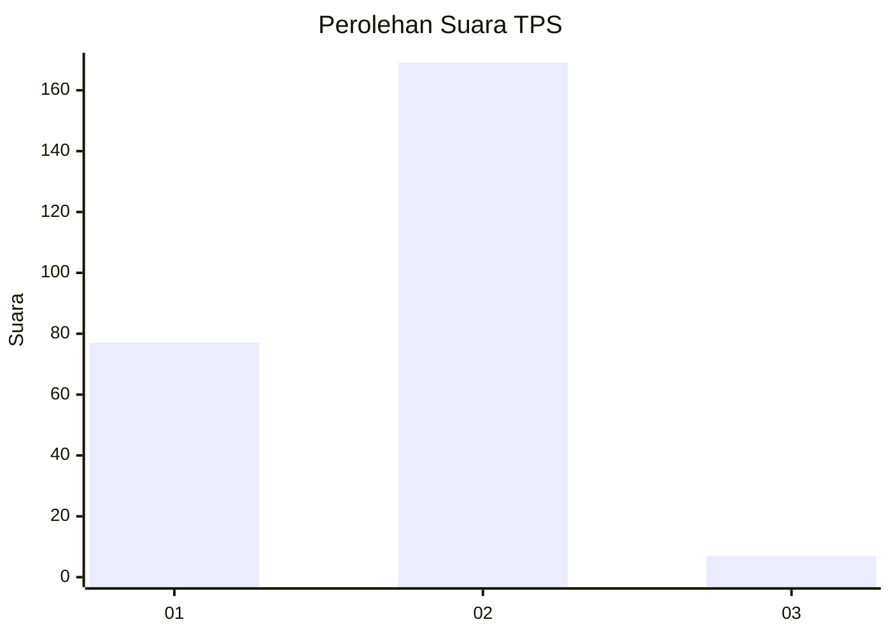
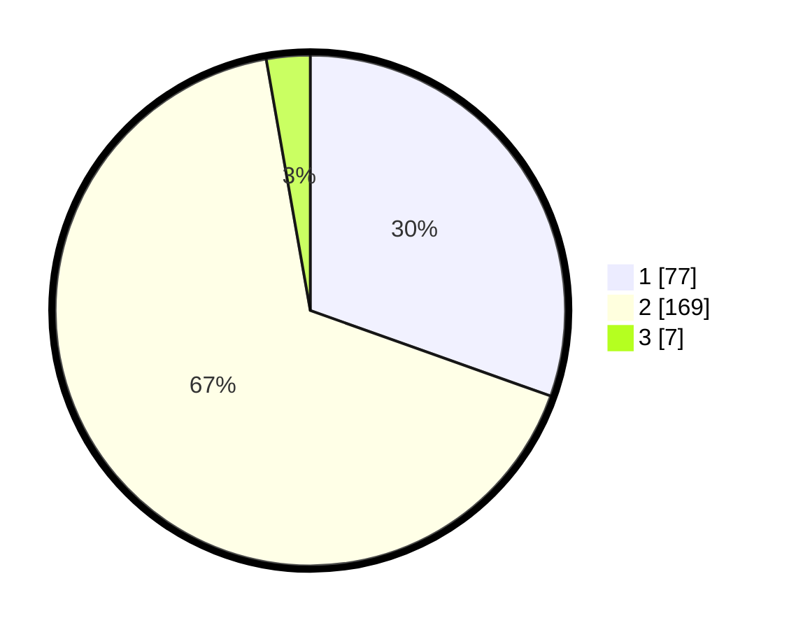

# Hasil

## Grafik

## Tabel

| No. | Nama Paslon    | Suara | Suara (raw) | Persentase |
|:--- |:-------------- | -----:| -----------:| ----------:|
| 1   | ANIES MUHAIMIN | 77    | [77][p-1]   | 30,43      |
| 2   | PRABOWO GIBRAN | 169   | [169][p-2]  | 66,80      |
| 3   | GANJAR MAHFUD  | 7     | [7][p-3]    | 2,77       |

[p-1]: https://github.com/gigit-pemilu/pemilu-2024-52-nusa-tenggara-barat/blob/main/pilpres/hitung-suara/sub/52-nusa-tenggara-barat/sub/72-kota-bima/sub/04-raba/sub/1001-penaraga/sub/004-tps/sub/paslon-1.txt
[p-2]: https://github.com/gigit-pemilu/pemilu-2024-52-nusa-tenggara-barat/blob/main/pilpres/hitung-suara/sub/52-nusa-tenggara-barat/sub/72-kota-bima/sub/04-raba/sub/1001-penaraga/sub/004-tps/sub/paslon-2.txt
[p-3]: https://github.com/gigit-pemilu/pemilu-2024-52-nusa-tenggara-barat/blob/main/pilpres/hitung-suara/sub/52-nusa-tenggara-barat/sub/72-kota-bima/sub/04-raba/sub/1001-penaraga/sub/004-tps/sub/paslon-3.txt

## Foto C Plano

https://sirekap-obj-formc.kpu.go.id/cea1/pemilu/ppwp/52/72/04/10/01/5272041001004-20240302-095102--e6d2a5b9-ad2e-42a1-8498-95fd2212a837.jpg

https://sirekap-obj-formc.kpu.go.id/cea1/pemilu/ppwp/52/72/04/10/01/5272041001004-20240302-095132--824f7a39-712d-4dce-bd10-439894733d04.jpg

https://sirekap-obj-formc.kpu.go.id/cea1/pemilu/ppwp/52/72/04/10/01/5272041001004-20240302-095145--217d2183-ed30-4ffb-958d-bb53271ed3fa.jpg

## Metadata

| Key        | Value               |
| ---------- | ------------------- |
| Time Stamp | 2024-03-16 12:00:00 |

