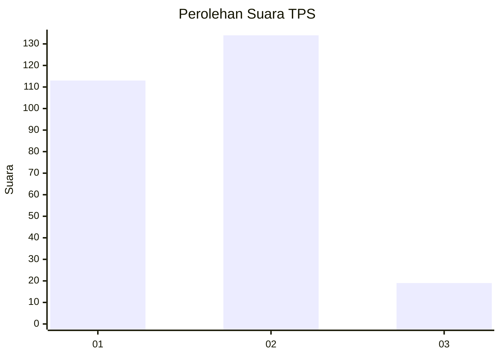
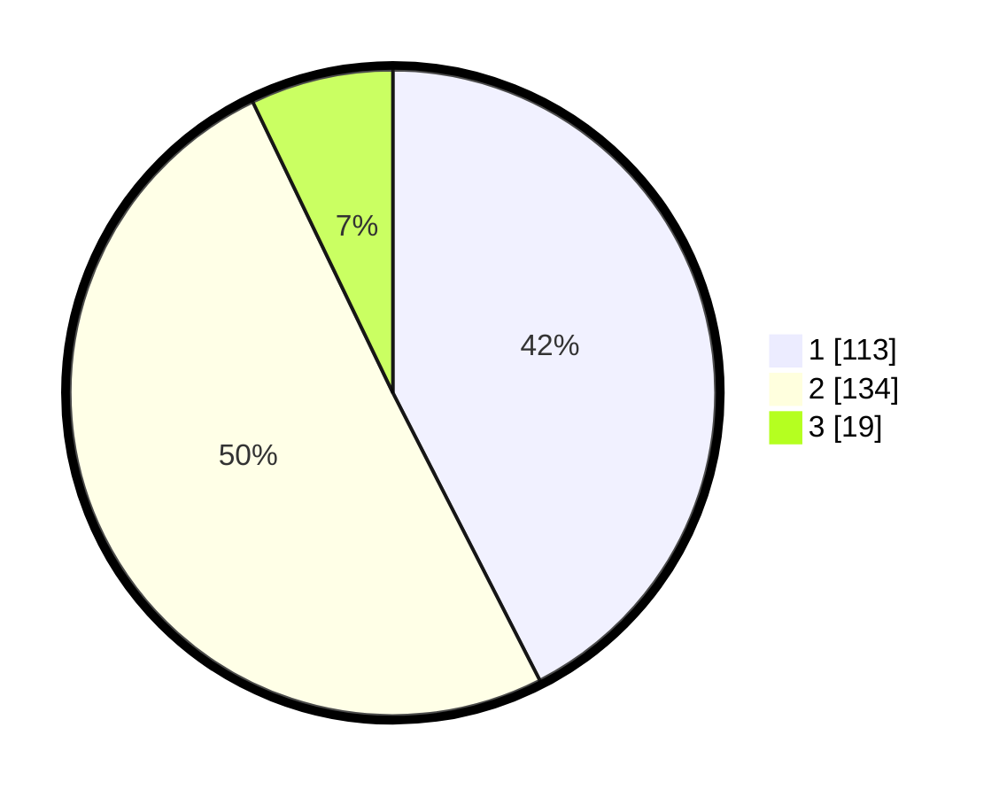

# Hasil

## Grafik

## Tabel

| No. | Nama Paslon    | Suara | Suara (raw) | Persentase |
|:--- |:-------------- | -----:| -----------:| ----------:|
| 1   | ANIES MUHAIMIN | 113   | [113][p-1]  | 42,48      |
| 2   | PRABOWO GIBRAN | 134   | [134][p-2]  | 50,38      |
| 3   | GANJAR MAHFUD  | 19    | [19][p-3]   | 7,14       |

[p-1]: https://github.com/gigit-pemilu/pemilu-2024-52-nusa-tenggara-barat/blob/main/pilpres/hitung-suara/sub/52-nusa-tenggara-barat/sub/72-kota-bima/sub/05-mpunda/sub/1002-sadia/sub/004-tps/sub/paslon-1.txt
[p-2]: https://github.com/gigit-pemilu/pemilu-2024-52-nusa-tenggara-barat/blob/main/pilpres/hitung-suara/sub/52-nusa-tenggara-barat/sub/72-kota-bima/sub/05-mpunda/sub/1002-sadia/sub/004-tps/sub/paslon-2.txt
[p-3]: https://github.com/gigit-pemilu/pemilu-2024-52-nusa-tenggara-barat/blob/main/pilpres/hitung-suara/sub/52-nusa-tenggara-barat/sub/72-kota-bima/sub/05-mpunda/sub/1002-sadia/sub/004-tps/sub/paslon-3.txt

## Foto C Plano

https://sirekap-obj-formc.kpu.go.id/1d2d/pemilu/ppwp/52/72/05/10/02/5272051002004-20240215-081111--35003120-da8b-4983-87fd-f34b1de63046.jpg

https://sirekap-obj-formc.kpu.go.id/1d2d/pemilu/ppwp/52/72/05/10/02/5272051002004-20240215-081232--02af68c1-1dba-4fd2-b737-52d75042e3c6.jpg

https://sirekap-obj-formc.kpu.go.id/1d2d/pemilu/ppwp/52/72/05/10/02/5272051002004-20240215-081415--75deee74-5f4a-4762-80c6-b7c0a5a7092f.jpg

## Metadata

| Key        | Value               |
| ---------- | ------------------- |
| Time Stamp | 2024-02-16 14:30:33 |

